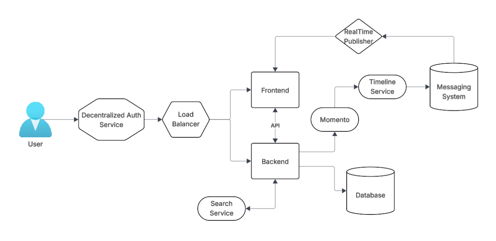
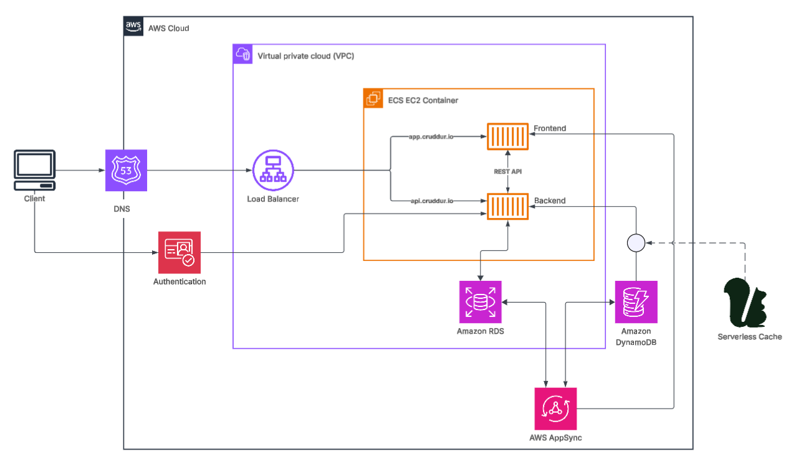

# Week 0 — Billing and Architecture

## Required homework

## AWS CLI, creating a budget and billing alarm

Homework included installing AWS CLI and creating AWS credentials on the Cloud using Linux. 

The budget, budget notification json file, billing alarm, and billing alarm json file were created through AWS CLI on Codespaces. The json files are on the aws/json folder. Codespaces was being used to replace Gitpod since Gitpod no longer exists and its replacement is not free to use. The billing alarm required a new SNS topic for which the subscription had to be confirmed via email. After confirmation the Cloudwatch alarm could be created through AWS CLI.

## Conceptual Architecture Diagram

 This is the Conceptual Diagram of Cruddur that I created on Lucidchart for the project.

[Link to Lucidchart Conceptual Architecture Diagram](https://lucid.app/lucidchart/e4224529-ef43-4ce2-b014-9a6b2014e827/edit?beaconFlowId=82F702AF9C95109E&invitationId=inv_16f8534f-8596-45e2-8306-18263f21a092&page=0_0#)

### Logical Architecture Diagram

This is the logical architecture diagram that I have created for Cruddur in Lucidchart. It shows the AWS components in greater detail.

[Link to Lucidchart Logical Architecture Diagram](https://lucid.app/lucidchart/c0105668-83bf-4459-8175-7651bd2883dc/edit?page=0_0#)
